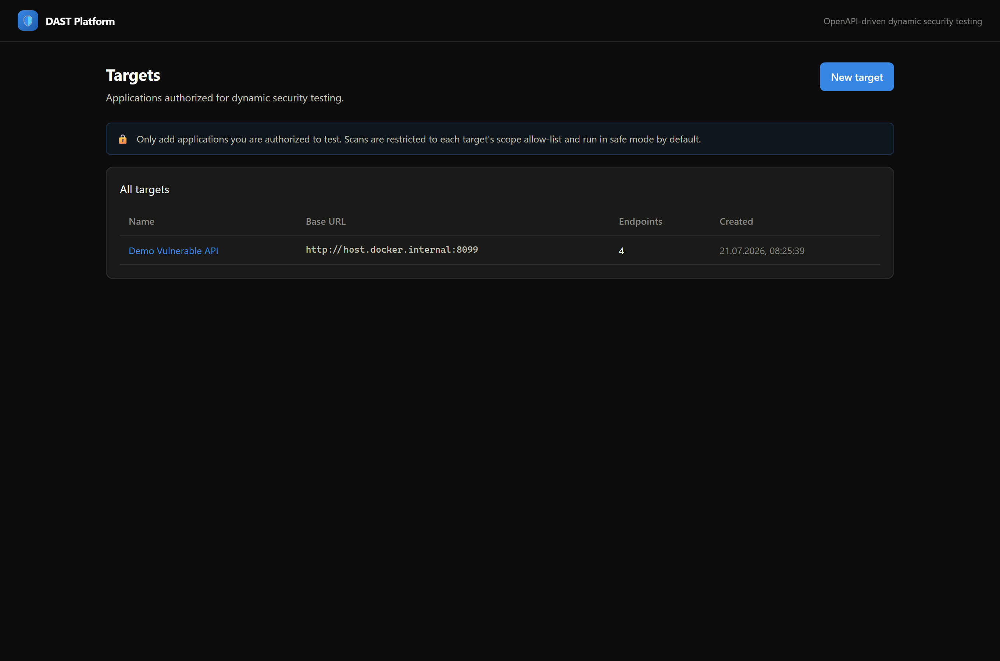
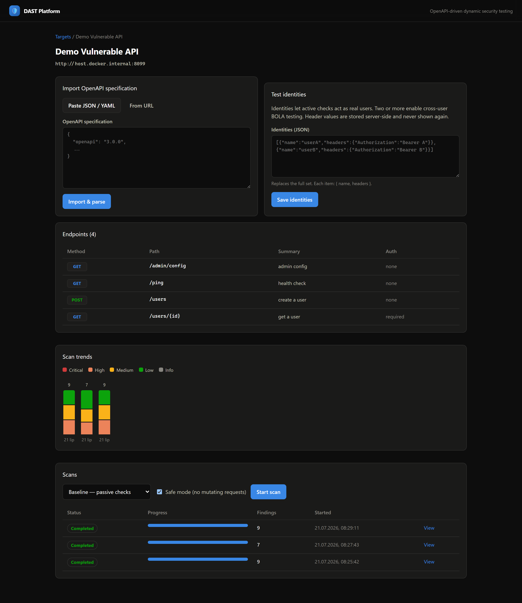
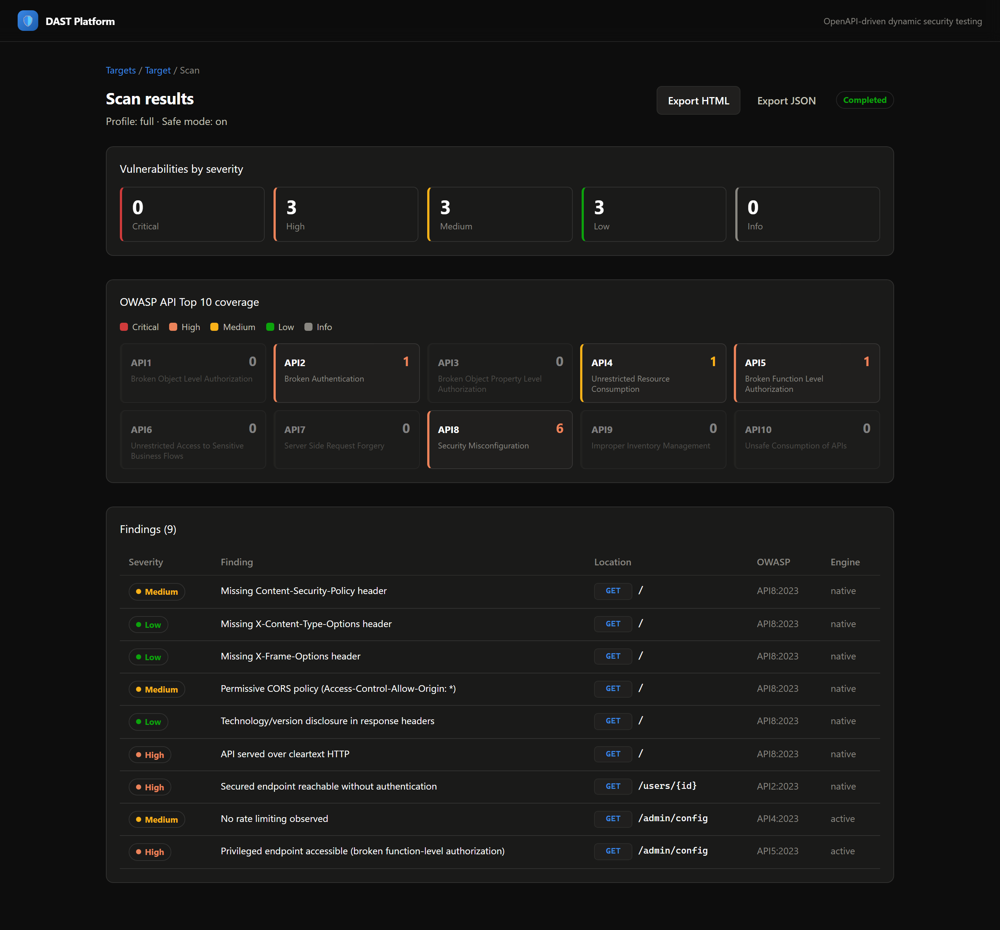
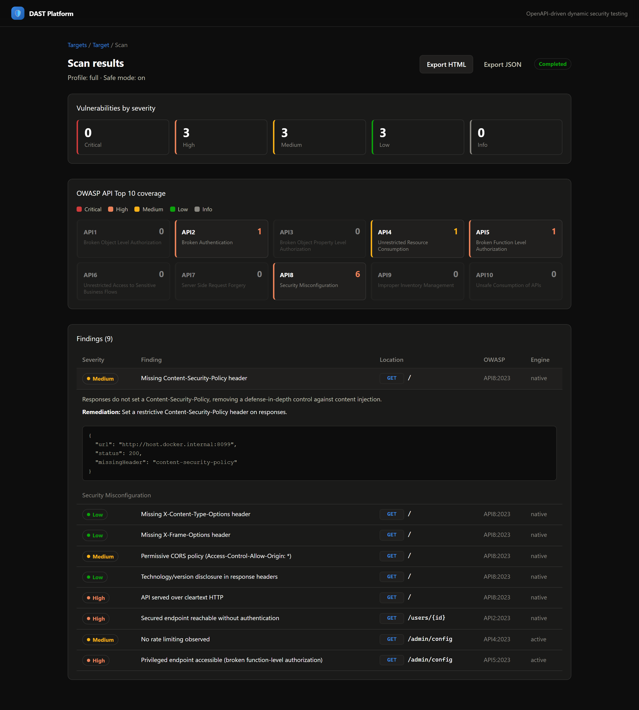

# DAST Platform

OpenAPI-driven Dynamic Application Security Testing. Point it at a running target
plus its OpenAPI specification and it scans the API for vulnerabilities, then shows
findings on a dashboard.

- **Hybrid scan engine** — a native TypeScript engine for spec-aware API-logic tests
  (BOLA/IDOR, function-level authz, mass assignment, missing auth) plus **OWASP ZAP**
  for broad injection / misconfiguration / TLS coverage.
- **Clean Architecture** backend (`domain` → `application` → `infrastructure` → `interface`).
- **Feature-based** React frontend.
- Runs entirely in containers.

## Screenshots

**Targets** — applications authorized for testing, each gated by a scope allow-list.



**Target** — import an OpenAPI spec, configure test identities, review the parsed
endpoints, and track findings across scans.



**Scan results** — a severity summary, the OWASP API Top-10 heatmap, and every finding
mapped by engine, exportable to HTML or JSON.



**Finding detail** — description, remediation, and the request/response evidence behind
each finding.



## Repository layout

```
packages/
  shared/     # Zod contracts + shared vocabulary (types) used by API and web
  backend/    # Fastify API + BullMQ worker, clean architecture
  frontend/   # React (Vite), feature-based
docker-compose.yml   # web · api · worker · zap · postgres · redis
```

## Quick start (containers)

```bash
cp .env.example .env
docker compose up --build
```

- Web UI: http://localhost:5173
- API:    http://localhost:4000

## Local development

```bash
corepack enable            # or: npm i -g pnpm@9
pnpm install
# bring up just the infra dependencies:
docker compose up -d postgres redis zap
pnpm db:migrate
pnpm dev                   # runs shared (watch) + api + worker + web
```

## Safety / authorization

DAST is active security testing. This tool only scans a **Target** whose host is on an
explicit scope allow-list, throttles request rate, and runs in **SAFE_MODE** by default
(no destructive payloads). Only scan systems you are authorized to test.

## Capabilities

Findings from every engine are normalized, de-duplicated, scored by severity, mapped to
the OWASP API Security Top 10, and streamed to the dashboard live over SSE.

### Scan engines

**Native passive checks** (baseline and full profiles) — throttled, scope-checked,
non-destructive probes over the imported endpoints (read-only methods only in safe mode):
security headers, permissive CORS, cookie flags, technology/version banner disclosure,
cleartext transport, authentication enforcement (a secured operation reachable
unauthenticated), and error / database / secret disclosure in responses.

**Native active checks** (full profile) — spec-aware, request-driven tests: rate limiting
(API4), broken function-level authorization (API5), BOLA/IDOR across identities (API1),
and mass assignment (API3, which mutates state and therefore only runs with safe mode off).

**OWASP ZAP** (full profile) — drives a ZAP daemon over its REST API: seeds the target's
endpoints, drains the passive scanner, runs an active scan when safe mode is off, and maps
ZAP alerts to findings. If ZAP is unconfigured or unreachable the scan continues without
it. Start ZAP with `docker compose --profile zap up`.

### Scan profiles

- **Baseline** — native passive checks only.
- **Full** — passive plus the active engine and ZAP.

Safe mode (on by default) restricts every engine to non-mutating requests.

### Dashboard & reporting

A severity summary, an OWASP API Top-10 heatmap (each category coloured by its worst
severity), a cross-scan trends chart, and per-finding evidence with remediation. Scans
export to a self-contained HTML report or JSON.

### Test identities

To run BOLA and function-level-authz checks as real users, set identities on a target
(Target page → Test identities), e.g.:

```json
[
  { "name": "userA", "headers": { "Authorization": "Bearer <token-A>" } },
  { "name": "userB", "headers": { "Authorization": "Bearer <token-B>" } }
]
```

Header values are stored server-side and never returned to the browser.
